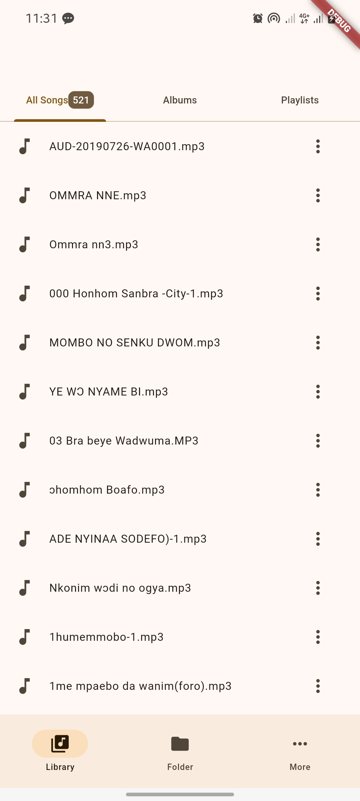
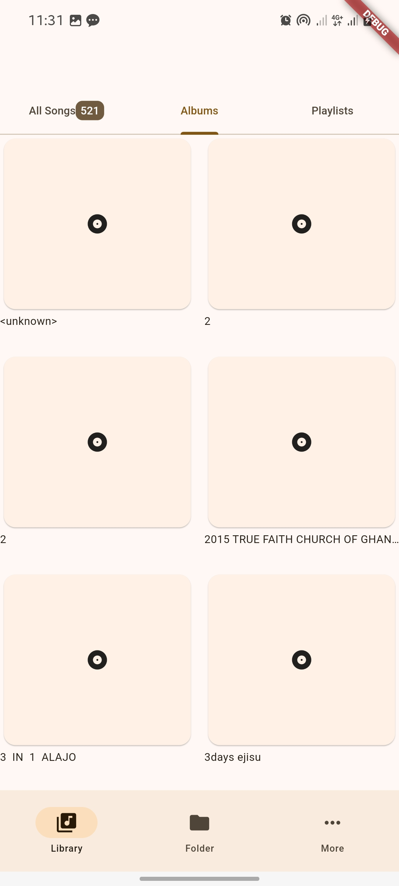
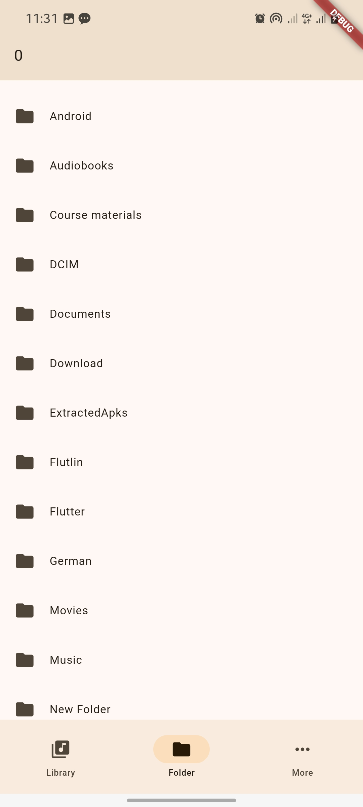
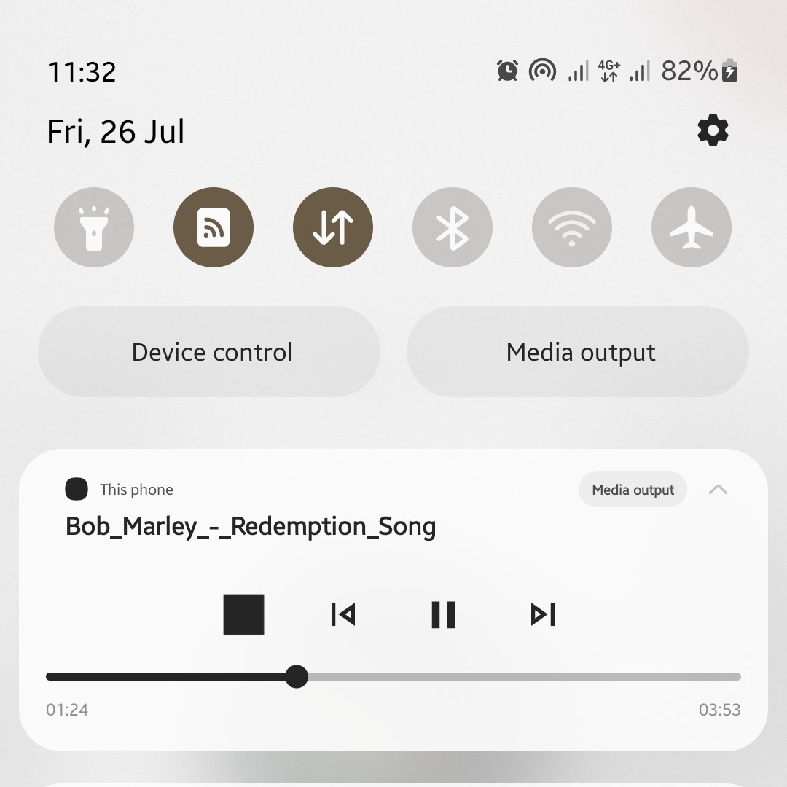
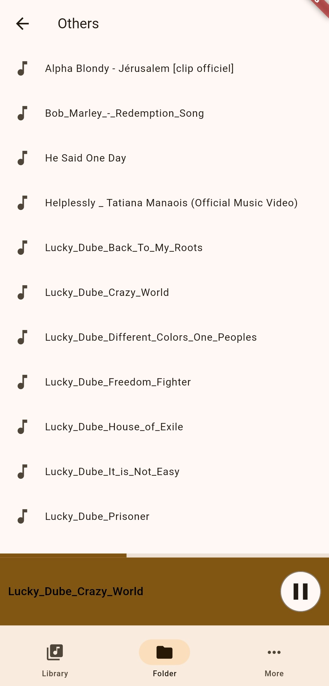

# beatz

A new Flutter project.

## Getting Started

This is a music player app made with flutter. It has features such background playing, can open audio files from other app, playlist features and anything basic thing an audio player app can do.

### Screenshots

<h4>
library screen
</h4>

<h4>
album screen
</h4>

<h4>
file explorer
</h4>

<h4>
Player screen
</h4>

Notification player

<h4>
</h4>

<h4>
Minimized player
</h4>

